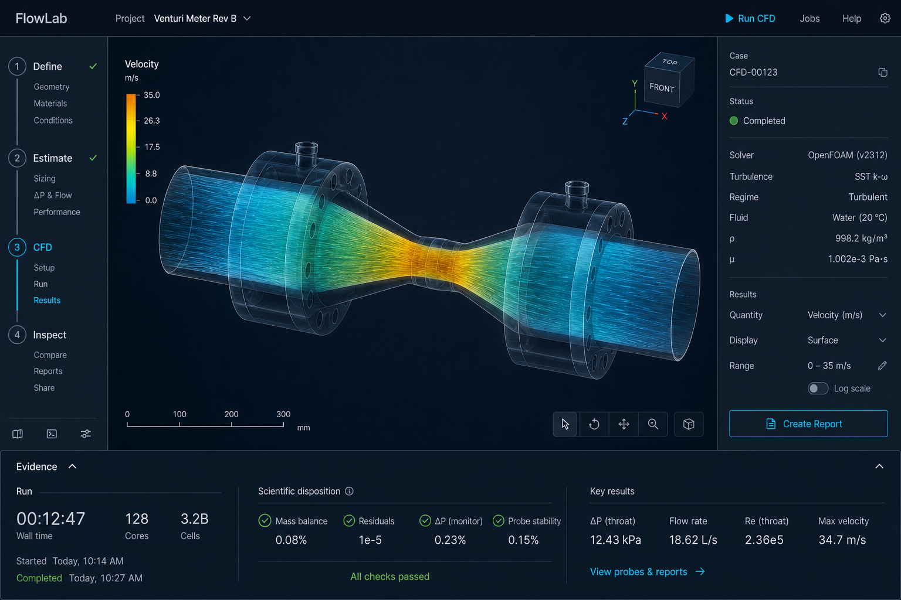
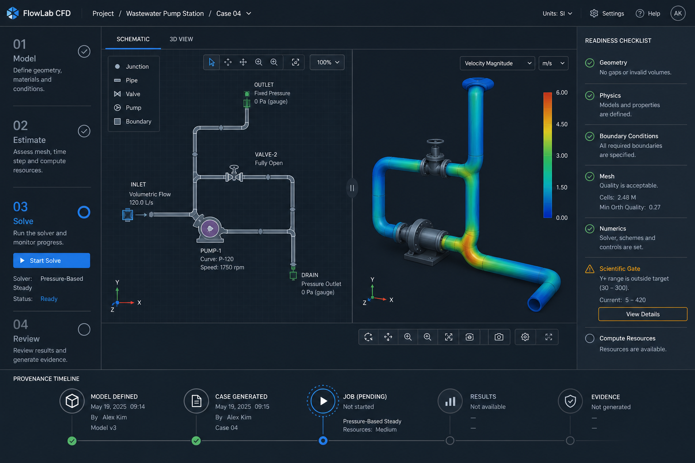
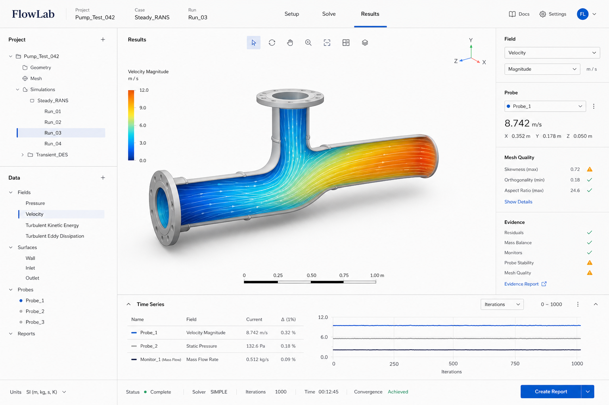

# FlowLab UI/UX redesign system

Status: **implemented desktop workspace direction; no solver, validation, or promotion behavior changed**

This document is the source of truth for the FlowLab UI implementation. It
resolves the current navigation and workflow overload while preserving the
existing scientific claim boundary: a complete job, a numerical candidate, an
empirically validated regime, promotion authorization, and external release
remain different states.

## Decision

Adopt **Option B — Guided dual-view workbench** as the implementation direction.

It pairs an editable schematic with its physical/3D interpretation so students
can connect what they draw to what the solver represents. It also makes
FlowLab's real operating sequence visible:

```text
Define → Estimate → CFD → Inspect
```

The left rail owns that sequence. The centre is always a linked pair: schematic
on the left, 3D model or result field on the right. The contextual inspector is
collapsible and owns only the active stage or selection. A single evidence
drawer at the bottom owns runtime, scientific disposition, and provenance. No
other area may duplicate those responsibilities.

The workflow-stage preview authority and fallback boundaries are specified in
[`FLOWLAB_PREVIEW_GOVERNANCE.md`](FLOWLAB_PREVIEW_GOVERNANCE.md). Labels in
that contract are product-state labels, not scientific validation or promotion
claims.

## Visual thesis

**A calm scientific instrument with an instructor beside it: the schematic and
the physical flow remain visible together, while evidence is legible at the
moment it matters.**

The app must feel deliberate and technical, not like a generic dashboard or a
gaming cockpit. The model/result is the visual anchor. Chrome recedes.

## Content and interaction theses

### Content

1. **Two linked representations first.** Schematic and 3D/result views remain
   visible together whenever the desktop width allows.
2. **Workflow second.** The next legitimate action is visible in the stage rail.
3. **Evidence third.** Runtime and scientific status are compact, specific, and
   expandable when the user needs audit detail.
4. **Configuration last.** Solver and mesh controls are contextual, not a
   permanently competing control surface.

### Interaction

- Selecting a schematic object highlights, frames, and names its counterpart in
  the 3D view; selecting a 3D object returns the selection to the schematic.
- Stage changes crossfade the contextual inspector and move the active stage
  indicator; they do not replace either primary view.
- The evidence drawer expands from a 40px summary strip to a focused audit
  surface. It never appears as a blocking modal.
- Selecting a node, edge, or result surface gives it a restrained cyan outline
  and opens its inspector context; no floating action bubble obscures the
  result field.

Respect `prefers-reduced-motion`: use instant state changes there.

## Options considered

### A. Evidence-first workbench



**Best for:** the core FlowLab experience: building, running, inspecting, and
accurately qualifying CFD work.

- Left: a four-stage rail with stage-specific substeps.
- Center: the dominant 2D/3D canvas.
- Right: selected-object or selected-result inspector.
- Bottom: a single evidence drawer with separate runtime and scientific
  disposition areas.

**What we borrow:** Its single evidence drawer, strict state separation, and
quiet scientific visual system. These are part of the selected direction.

### B. Guided dual-view workbench — selected



**Best for:** students, first-time users, and engineers who benefit from seeing
the abstract network and physical simulation as one connected model.

- A numbered left workflow makes the next legitimate step explicit.
- The schematic and 3D/result viewport remain side by side and share selection,
  camera framing, and colour-field context where applicable.
- A stage-local readiness checklist explains what must happen next.
- The bottom evidence/provenance drawer makes job progression inspectable.

**Guardrail:** The workflow guides; it does not force a wizard. Users can
return to Define or Estimate at any time. A completed UI stage means only that
its preparatory controls are satisfied—it is never a scientific validation
claim.

### C. Analysis studio



**Best for:** result review, report preparation, and technical presentations.

- Light editorial surface with very high chart and field readability.
- Project/data navigation on the left; probes, mesh quality, and evidence on
  the right; time history below.

**Trade-off:** This is the clearest result-inspection mode, but it is not the
right default for a dark desktop modelling workstation. Adopt its typography,
field hierarchy, and report-oriented Inspect stage—not its light theme—as
selective influences.

Generated images are conceptual layout and art-direction references. They do
not define exact copy, available solvers, physics capability, or scientific
status.

## Target information architecture

```text
Top bar
  Project identity · selected run · Inspector · Undo · Redo
  Save · Save + results · Open

Workflow rail
  1 Define      geometry · fluid · boundaries
  2 Estimate    instant 1D · sweeps · risk flags
  3 CFD         solver · mesh · readiness · run
  4 Inspect     fields · probes · diagnostics
  Hide panels / Show panels

Dual primary workspace
  Stage action bar
  Schematic | Split | 3D view
  Schematic editor ↔ 3D model / result viewer

  Shared selection · linked focus framing · shared active result context

Context inspector
  Component properties · Solver settings · Guided first case · Project preset

Evidence drawer
  Runtime | Scientific disposition | Provenance | Warnings
  Hide panel / Show panel
```

The three file actions carry visible words, not icons alone: `Save`,
`Save + results`, and `Open`. Undo and Redo stay icon-only because they are
reversible.

### Ownership rules

| Area | Owns | Must not own |
| --- | --- | --- |
| Top bar | project identity, persistence, global help | solver configuration or result controls |
| Workflow rail | stage, substep, next action | duplicate settings navigation |
| Schematic view | direct network editing and topology feedback | long-form configuration forms or diagnostics |
| 3D/result view | geometry/result visualization and probing | primary topology editing |
| Inspector | selection and stage-local configuration | persistent run history or global state |
| Evidence drawer | logs, diagnostics, mesh blockers, provenance, claim status | primary editing |

## Workflow specification

### 1. Define

Goal: make a geometrically and physically coherent model.

1. Start from a preset or import a project.
2. Add/edit components on the canvas.
3. Set fluid and boundary conditions in the inspector.
4. Resolve topology errors before leaving the stage.

The schematic is the editing authority. The adjacent 3D view shows a faithful
physical interpretation of the selected network component and its dimensions;
it is not an independent competing editor.

Primary CTA: **Estimate this system**. It runs the instant estimate and moves
to the Estimate stage.

Do not call a preview a simulation here. If the network is incomplete, show the
specific issue beside the affected object and in the stage rail.

The component palette holds one entry per component that a click can add:
`Source`, `Pump`, `Venturi`, `Bend`, `Valve`, `Mixer`, and `Sink`. A pipe is
made by dragging between two ports, so the palette has no `Pipe` entry. `Bend`
replaced the earlier `Elbow` label because the palette names the part, not the
angle.

### 2. Estimate

Goal: obtain the instant 1D estimate and understand basic risk.

1. Run the browser-side hydraulic estimate automatically after valid edits,
   with an explicit **Recompute estimate** action for control.
2. Surface total flow, pressure loss, Reynolds range, and cavitation risk in a
   compact shared overlay, with the affected component highlighted in both
   views.
3. Configure and run sweeps from this stage only.

Primary CTA: **Recompute estimate**. The action that moves the work forward is
the secondary **Set up a CFD run**.

Use the label **Instant estimate**, never `Run preview`, to distinguish it from
CFD execution.

The canvas particle animation sits beside the two views it animates, not in the
Inspector, and it is labelled
`Illustrative estimate animation—not CFD`.

### 3. CFD

Goal: prepare and run an experimental solver case.

1. Set the physics envelope, geometry/mesh mode, and case controls.
2. Read the runtime readiness and blocking issues.
3. Run the case.
4. Track the run and read what it produced.

During a run, the left view retains the case schematic and the right view shows
the best available physical state: setup geometry before fields exist, then the
loaded result field when available. This makes the transition from model to
solver result teachable.

**One control runs the case.** The primary CTA is `Run CFD case` in every
state. It generates the case, selects a runnable CFD solver if Instant 1D is
still selected, and queues the job. There is no separate `Use OpenFOAM` fix and
no separate `Generate and queue experimental CFD case` action. A user must not
have to repair a setting before the one button will work.

The button is disabled only when the run genuinely cannot start. The line below
it always states either the blocker or what the button is about to do:

| State | Line below the button | Button |
| --- | --- | --- |
| Blocking model warnings | name the count of blocking network issues | disabled |
| Local service offline | name the offline service | disabled |
| Solver runtime not runnable | name the missing dependency | disabled |
| Instant 1D still selected | `Switches … to … , then runs` plus mesh and run mode | enabled |
| Ready | `Ready: …` plus mesh and run mode | enabled |

While the job runs, a progress readout states the run state, the elapsed time,
and the latest solver time or iteration. Progress is never convergence: it may
not be presented as a scientific state.

When the job reaches a terminal state, the stage states what it produced and
offers `View fields in Inspect` and `Open solver diagnostics`. A terminal
status is a runtime state, not a validation claim.

### 4. Inspect

Goal: inspect the correct result, evidence, and scope of claim.

1. Choose a recent job, import VTK/VTU, or load the bundled fixture.
2. Select field, component, colour map, and time.
3. Probe values in the 2D/3D canvas.
4. Inspect mesh blockers, residual, patch, and artifact evidence.
5. Export a project, a result bundle, or a timeline CSV.

Primary CTA: **Import VTK/VTU**.

There is no evidence-report export. Do not describe one as available. If it is
added, it must label its status rather than infer validation.

## Scientific state system

Every result screen and report uses two adjacent labels:

1. **Runtime status**: not generated / generated / queued / running / complete
   / failed / cancelled.
2. **Scientific disposition**: experimental / numerical-verification candidate
   / empirically validated bounded regime / promotion blocked / promotion
   authorized.

Never substitute one for the other. Never use a green complete-job status to
imply that a scientific gate passed.

Plain-language content pattern:

```text
Promotion blocked
The numerical campaign is complete, but the required independent experimental
validation is not accepted. This result can be inspected, not used as an
approved validated preset.
```

The exact disposition, gates, reasons, and API behavior remain controlled by
the existing benchmark registry and fail-closed backend. This redesign does not
change them.

## Style guide

### Typography

Use two faces at most:

- **UI and numbers:** Inter or the system UI stack; tabular numerals for all
  measurements, timestamps, and residuals.
- **Optional report/display face:** Instrument Serif only in exported reports
  or the Inspect-stage heading; do not use it in operating controls.

| Token | Value |
| --- | --- |
| display | 24/30, 650 |
| section | 15/20, 650 |
| body | 13/19, 450 |
| label | 11/15, 600 |
| numeric metric | 18/22, 600, tabular |

### Colour

| Token | Value | Use |
| --- | --- | --- |
| `ink-950` | `#07111B` | application background |
| `ink-900` | `#0C1824` | primary surface |
| `ink-800` | `#132333` | raised/context surface |
| `line-subtle` | `rgba(180, 210, 228, .14)` | dividers only |
| `text-strong` | `#F2F7FA` | principal text |
| `text-muted` | `#93A6B4` | secondary text |
| `action-cyan` | `#28C6F3` | one primary action and active state |
| `pass-green` | `#4FD18C` | satisfied runtime/evidence check only |
| `warn-amber` | `#F3B449` | unresolved or blocked state |
| `danger-red` | `#EA6675` | error or failed job/gate |

Do not use colour as the only evidence state signal. Every state has an icon,
label, and concise explanation.

### Surface and spacing

- Use flat nested surfaces with hairline dividers; avoid card mosaics.
- Radius: 6px for controls, 8px for drawers, 10px only for modal surfaces.
- Shadow: one soft ambient shadow for the evidence drawer or modal only.
- Spacing scale: 4, 8, 12, 16, 24, 32, 48 px.
- Canvas viewport receives at least 55% of desktop width at 1440px; routine
  panels must give way before the two primary views do.
- At widths of 1440px and above, each primary view receives at least 420px.
  Below that, the contextual inspector becomes an overlay drawer before either
  view is reduced below its usable width. Mobile remains out of scope.

### Control rules

- Use visible labels for global import/export actions at normal desktop widths.
- Icons supplement labels; they do not replace them for irreversible or
  file-affecting actions.
- There is one primary CTA per stage.
- A bottom drawer uses tabs only for evidence categories; it must not recreate
  global navigation.
- Place result tools near the canvas, but place long-form field configuration
  in the inspector.

### Accessibility rules

- Minimum 4.5:1 text contrast; retain focus rings above canvas overlays.
- Every stage, layer, and tool toggle exposes name, pressed state, and keyboard
  focus.
- `P` toggles probe mode and visibly changes the cursor and canvas badge.
- The evidence drawer is reachable after the canvas in logical focus order.
- Motion lasts 160–220ms, has no essential meaning, and respects reduced
  motion.

## Component conventions

| Component | Rule |
| --- | --- |
| Stage rail | One active stage; completed only means required UI preparation is complete, not scientific validation. |
| Dual-view divider | 50/50 default; user-adjustable between 40/60 and 60/40; persist as a versioned local-workspace preference only. It never changes the project document, undo history, export, or generated case. |
| Linked selection | Selection, focus framing, and active field context are mirrored between schematic and 3D views. |
| Canvas toolbar | 5–7 visible tools maximum; overflow secondary actions. |
| Inspector | Titled collapsible groups: `Component properties`, `Solver settings`, `Guided first case`, `Project preset`. Each group names its own content; the group that matches the current stage leads. |
| Workspace view control | `Schematic`, `Split`, `3D view`. `Split` is the default. |
| View plane group | `Iso`, `XY`, `XZ`, `YZ`. Each turns the camera the user already has onto a named plane and keeps their zoom and pan. |
| Simplified view | A renderer choice, not a camera orientation. It stands outside the view plane group and carries its own name. |
| Panel collapse | The side panels and the bottom panel each collapse from a named control that says what it acts on in both states. |
| Reveal group | Secondary controls sit behind a title that states how much is behind it. A group opens itself when it holds something the user must act on. Nothing a user must act on stays folded away. |
| Status row | `Runtime` and `Scientific disposition` are always separate. |
| Evidence drawer | Collapsed summary shows a short disposition and count of active warnings. |
| Probe | Persistent `Probe mode` badge, crosshair cursor, and field/unit hint. |
| Empty states | Explain source and action: `No result loaded` above `Import VTK/VTU or open a completed local job.` |
| Sweep | The panel is titled by the parameter it varies and its unit, for example `Sweep: diameter (mm)`. It never names a parameter it does not read from the sweep record. |

### Progressive disclosure contract

Advanced mesh tuning, imported STL geometry, the solver-service read-out,
numeric camera angles, streamline seeding, and field statistics sit behind
reveal groups. The rules are:

- the body stays in the document and is hidden, so state inside a closed group
  survives;
- the header states how much is behind it, so a closed group advertises what it
  holds;
- a group opens itself the moment it holds a blocker, a warning, or a failed
  run, whatever the user last chose; and
- the user may close it again, because a signal they have read is not one the
  interface should keep repeating.

Blockers never go behind a reveal group. A run that cannot start says so beside
the settings.

### Divider and view-mode persistence contract

The divider is stored only in the local workspace key
`flowlab.workspace.dual-view.v1` as `{ version: 1, schematicRatio }`. Malformed,
unknown-version, and out-of-range values reset or clamp safely to the 40–60%
range.

The workspace view mode is stored only in `flowlab.workspace.view-mode.v1`. An
unknown value falls back to `split`.

Both keys are deliberately absent from `FluidProject`, project exports, undo
history, generated case files, and result provenance.

### Stage-containment and job-status contract

- Define owns project layers, the component palette, and destructive schematic
  editing actions. Those controls are not rendered in Estimate, CFD, or
  Inspect.
- Estimate owns instant-estimate recompute and sweeps. CFD owns solver
  configuration, runtime readiness, case generation, and the run.
  Inspect owns VTK/VTU import, fixture loading, result fields, probes, and
  reference/evidence views.
- The evidence drawer shows only the tabs its stage owns: Metrics and Warnings
  in Define; Sweep, Metrics, and Warnings in Estimate; Diagnostics and Warnings
  in CFD; Field viewer, Diagnostics, and Warnings in Inspect. It defaults to
  Metrics in Define, Sweep in Estimate, Diagnostics in CFD, and Field viewer in
  Inspect. A visible tab always owns the drawer body beneath it.
- There is no Mesh QA tab. The mesh quality numbers it carried — skewness,
  non-orthogonality, aspect ratio, and minimum volume — were removed because a
  user cannot act on them. What survives is the part a user can act on after a
  failure: which native mesh command was missing or failed, how many `checkMesh`
  checks failed, and the blocking reasons. That evidence sits in Diagnostics,
  where a user looks after a failure. The generated case still records the full
  mesh evidence; only the panel was removed.
- Instant 1D is browser-side and cannot itself be queued as a CFD job. The one
  run control selects a runnable CFD solver first and then queues. It never
  presents Instant 1D as a queued CFD job. Returned job status and error text
  are displayed without converting a blocked response into a queued claim.
- `Illustrative estimate animation—not CFD` names only the canvas particle
  animation. It is never a solver, runtime, convergence, or validation status.
- `Not this case’s mesh` names the case in which the CFD stage keeps the
  concept drawing. Its exact wording and reasons are in
  [`FLOWLAB_PREVIEW_GOVERNANCE.md`](FLOWLAB_PREVIEW_GOVERNANCE.md).

## Implementation plan

### Milestone 1 — structural clarity

1. Replace the duplicated top tabs/left rail with the four-stage workflow rail.
2. Build the linked schematic/3D split workspace with a resizable divider and
   the `Schematic | Split | 3D view` control.
3. Rename `Run preview` to `Recompute estimate`, and reduce `Use OpenFOAM` plus
   `Generate and queue experimental CFD case` to one `Run CFD case` control.
4. Move the existing bottom dock into one tabbed evidence drawer.
5. Preserve every existing control and API behavior behind the new composition.

**Acceptance:** a new user can identify the current stage, the next action,
how the schematic maps to the 3D representation, the active solver case, and
whether a result is experimental within five seconds.

### Milestone 2 — contextual operation

1. Make the Inspector stage- and selection-specific.
2. Promote runtime readiness to a CFD-stage checklist.
3. Add persistent probe-mode affordance and clearer import/result empty states.
4. Add a field/result selection hierarchy inspired by Option C.

**Acceptance:** keyboard and pointer users can edit a model, run an instant
estimate, identify a missing solver dependency, load a result, and probe it
without searching unrelated panels.

### Milestone 3 — evidence and reporting

1. Create an evidence drawer with runtime, diagnostics, mesh blockers,
   provenance, and scientific disposition.
2. Render plain-language explanations beside governed scientific status.
3. Keep the validated-preset action hidden and HTTP 409 behavior unchanged when
   promotion is blocked.
4. Not implemented: a clearly scoped evidence-report export that cannot
   overstate the job's scientific disposition. The Inspect stage exports a
   project, a result bundle, and a timeline CSV only.

**Acceptance:** a historical completed job cannot visually or textually
override the current governed campaign gate.

## Out of scope

- Changing solver, mesh, benchmark, campaign, evidence, promotion, or release
  rules.
- Making experimental generated cases appear validated.
- Mobile product work.
- New external distribution claims.

## Implementation guardrail

Any screen that exposes a result, report, preset, or promotion state must be
reviewed against the current final assessment and product-contract tests. UI
copy may improve comprehension, but it must not broaden the scientific claim.
